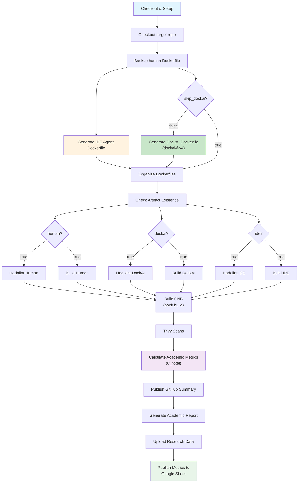

# Compare Builds Workflow Steps

```mermaid
flowchart TD
    A["Checkout & Setup"] --> B["Checkout target repo"]
    B --> C["Backup human Dockerfile"]

    C --> D["Generate IDE Agent Dockerfile"]
    C --> E{"skip_dockai?"}
    E -- "false" --> F["Generate DockAI Dockerfile\n(dockai@v4)"]
    E -- "true" --> G["Organize Dockerfiles"]
    D --> G
    F --> G

    G --> H["Check Artifact Existence"]

    H --> I{"human?"}
    H --> J{"dockai?"}
    H --> K{"ide?"}

    I -- "true" --> I1["Hadolint Human"]
    J -- "true" --> J1["Hadolint DockAI"]
    K -- "true" --> K1["Hadolint IDE"]

    I -- "true" --> L["Build Human"]
    J -- "true" --> M["Build DockAI"]
    K -- "true" --> N["Build IDE"]

    I1 --> O["Build CNB\n(pack build)"]
    J1 --> O
    K1 --> O
    L --> O
    M --> O
    N --> O

    O --> P["Trivy Scans"]
    P --> Q["Calculate Academic Metrics\n(C_total)"]
    Q --> R["Publish GitHub Summary"]
    R --> S["Generate Academic Report"]
    S --> T["Upload Research Data"]
    T --> U["Publish Metrics to\nGoogle Sheet"]

    style A fill:#e1f5fe
    style F fill:#c8e6c9
    style D fill:#fff3e0
    style Q fill:#f3e5f5
    style U fill:#e8f5e9
```
